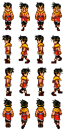
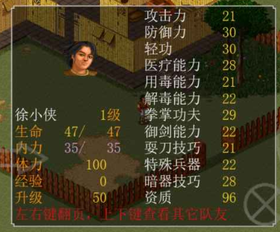
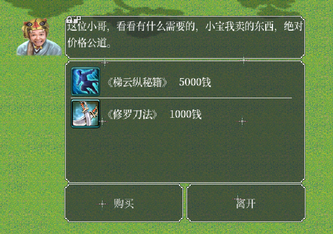
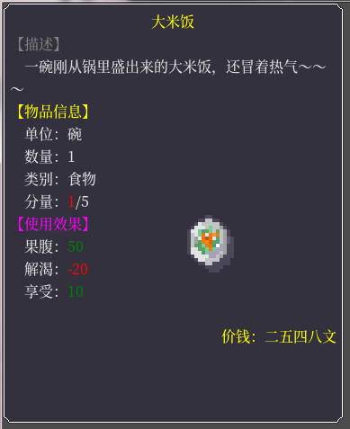

# WuXiaAndJiangHu_Godot 武侠和江湖  godot开发笔记

## 抱歉，天天换开发工具。
*  在用love2d框架开发中，发现点问题。如发布和添加广告，第三方SDK支持等。
* 而且因为love2d的用户群体过少，自己编程水平很一般，遇到的问题难以解决，比如想加个广告。。
* 考虑到游戏最终发布，忍痛换工具，近期在学习godot游戏引擎。
* love2d还是很好用的，很适合学习，做工具，还会继续密切关注。


## 已经基本掌握godot引擎
* 通过学习官网教程，和网上一些教程。目前已经基本掌握godot。
* 游戏的整体框架思路，已经逐渐定型，素材收集也差不多。换引擎不会影响太多。
* godot引擎，目前用起来，感觉不错。很顺手。

## 开发随笔
* RPGmaker类行走图素材处理
  
  含金量不高，只是作为自己的一点记录。
  注：绝大数素材来源于网络，仅为学习使用（极个别是自己绘制的）

  1. 行走图素材
   
   

  2. 新建Sprite，将序列图纹理素材导入
   
  3. 新建AnimationPlayer，新建4个方向的行走动画
  4. 点击frame右边的钥匙标记，可以快速添加动画 
   
  5. 添加RayCast射线检测，用于简单碰撞
   
  6. 添加脚本，实现控制，脚本未做清理
   
   ```JavaScript
    extends Area2D
    export(int) var head_id = 0
    var tile_size = 32
    var can_move = true
    var facing = 'right'
    var moves = {'right': Vector2(1, 0),
    			 'left': Vector2(-1, 0),
    			 'up': Vector2(0, -1),
    			 'down': Vector2(0, 1)}
    var raycasts = {'right': 'RayCastRight',
    				'left' : 'RayCastLeft',
    				'up': 'RayCastUp',
    				'down': 'RayCastDown'}

    func move(dir):
    	if get_node(raycasts[facing]).is_colliding():
    		return
    	facing = dir
    	can_move = false
    	$AnimationPlayer.play(facing)
    	$MoveTween.interpolate_property(self, "position", position,
    								position + moves[facing] * tile_size, 0.6,
    								Tween.TRANS_LINEAR, Tween.EASE_IN_OUT)
    	$MoveTween.start()
    	return true

    func _on_MoveTween_tween_completed( object, key ):
    	can_move = true

    ```

* RPGmaker类自动地图在godot中使用
  
  1. 新建Tiledmap，新建TileSet，设置合适的cell大小
  2. 注意：rpgmaker类，自动地图，表面是32*32大小，但在实际处理时，底层是再次分解为16*16计算的，因此这里需要设置为16*16
  3.  点击tilemap里面的tileset下面的"打开编辑器"
  4.  新建autotile，设置snap options里面的 step为16*16，设置bitmask(这里是自动地图的关键)，如图测试，如果不对可以重新编辑

        
  5.  注意图中的例子并不完整，剩下的需要自己摸索，下面给点提醒
  6.  自动地图，需要底层和表层同时设置才行。像例子中并没有弄底层，只考虑了表层，而且图中的素材为网络拼凑而成，缺少合适的底层，并不可取。
  7.  简单图形的自动地图，如矩形类地毯，可以只管下面的部分，这个时候，cell大小可以设置为32*32，同理snap options里面的 step也可以设置为 32*32。

  

* 基本保存
```JavaScript
func save(content):
    var file = File.new()
    file.open("user://save_game.dat", file.WRITE)
    file.store_string(content)
    file.close()
func load():
    var file = File.new()
    file.open("user://save_game.dat", file.READ)
    var content = file.get_as_text()
    file.close()
    return content
```
* json的基本使用
```JavaScript
var p = JSON.parse('["hello", "world", "!"]')
if typeof(p.result) == TYPE_ARRAY:
    print(p.result[0]) # prints 'hello'
else:
    print("unexpected results")
```
* 读取json数据
  
  假如我们有如下数据，并转为JSON。

  

  PS：这里推荐国人制作的excel转lua json等的一个强大工具

    https://github.com/zhangqi-ulua/XlsxToLua

```JavaScript
func load_data(path:String):
	var load_data = File.new()
	if not load_data.file_exists(path):
		print_debug("not exists file")
		return
	
	load_data.open(path,File.READ)

	var data_str = load_data.get_as_text()
	var p = JSON.parse(data_str)
	return p.result
```
* 获取目录下特定后缀文件
```JavaScript
func dir_files(path,suffix):
	var dir = Directory.new()
	var files = []
	if dir.open(path) == OK:
		dir.list_dir_begin()
		var file_name = dir.get_next()
		while (file_name!= ""):
			if dir.current_is_dir():
				print("Found directory" + file_name)
			elif file_name.split(".")[-1] == suffix:
				files.append(file_name)
				print("Found file: " + file_name)
			else:
				print("Found file: " + file_name)
			file_name = dir.get_next()
	else:
		print("An error ccurred when trying to access the path.")
	return files	
```

* 读取文件夹下图片素材生成动画

    假如我们的动画文件在单个文件夹中


```JavaScript
extends Node2D
# 选择目录下的png
export(String,DIR) var path
export(String) var anim

func _ready():
    $AnimatedSprite.frames = creatAnimation(path)
    $AnimatedSprite.speed_scale = 4
    $AnimatedSprite.play("default")
    pass

func dir_contents(path):
    var dir = Directory.new()
    var file_list = []
    if dir.open(path) == OK:
        dir.list_dir_begin()
        var file_name = dir.get_next()
        while(file_name != ""):
            if dir.current_is_dir():
                print("Found directory: " + file_name)
            else:
                if file_name.split(".")[-1] == "png":
                    file_list.append(file_name)
                    print("Found file: " + file_name)
            file_name = dir.get_next()
    else:
        print("An Error occurred when trying to access the path.")
    return file_list

func creatAnimation(path:String):
    var sprite_sheet = dir_contents(path)
    var sprite_frames = SpriteFrames.new()
    for i in sprite_sheet.size() :
        var frame = load(path + "/" + sprite_sheet[i])
        sprite_frames.add_frame("default",frame)
    return sprite_frames
```

* 利用ninepach简单风格的对话框
  
  一些国产游戏会用到的内圆弧的风格
  
  
  

  做这个效果很简单
  1. 准备素材
  
  
  2. 新建NinePatchRect然后设置合适的pachmargin
   
  3. 将其他的控件放到NinePatchRect下。按钮类，可能需要设置flat为true。否则会调用按钮的风格。 也可以以此风格为主，深入修改Theme，那样需要较多的绘制，不擅长，不做累述。
    

* 用richtextlabel生成物品信息面板
 
  
  
  利用到上面的知识，结合richtextlabel
  
  

  ```JavaScript
  extends Node2D

    func _ready():
    	$Panel/NinePatchRect/RichTextLabel.bbcode_text = creat_food_bbc()
    	pass # Replace with function body.

    func creat_food_bbc():
    // 用字典模拟物品数据
    	var dict = {}
    	dict.name_cn = "大米饭"
    	dict.direction = "一碗刚从锅里盛出来的大米饭，还冒着热气～～～"
    	dict.unit = "碗"
    	dict.number = "1"
    	dict.type = "食物"
    	dict.pice = 1
    	dict.pice_max = 5
    	dict.food = 50
    	dict.water = -20
    	dict.happy = 10
    	dict.value = 2548
    	
        var bbc ="""[center][color=#ffff00]""" + dict.name_cn + """[/color][/center]
    color=gray]【描述】[/color]
    	""" + dict.direction + """
    color=yellow]【物品信息】[/color]
    	单位："""+ dict.unit +"""
    	数量："""+ str(dict.number) +"""
    	类别："""+ dict.type + """
    	分量：[color=red]""" + str(dict.pice) +"""[/color]/"""+ str(dict.pice_max) +"""
    color=fuchsia]【使用效果】[/color]
    	果腹：[color="""+ get_number_color(dict.food) +"""]"""+ str(dict.food) +"""[/color]
    	解渴：[color="""+ get_number_color(dict.water) +"""]"""+ str(dict.water) +"""[/color]
    	享受：[color="""+ get_number_color(dict.happy) +"""]"""+ str(dict.happy) +"""[/color]
    	[right][color=yellow]价钱："""+ get_chinese_number(dict.value) +"""文[/color][/right]
    	"""
    	return bbc
    // 用于根据数字输出颜色string，这里可以按需要深度更改
    func get_number_color(number):
    	if number < 0: return "red" 
    	else:return "green"
    
    // 用于将数字转化为文字

    func get_chinese_number(n:int):
    	var number_str = str(n)
    	var l = number_str.length()
    	var output = []
    	for i in range(l):
    		number_str[i] = swap_to_font(number_str[i])
    	return number_str
    
    func swap_to_font(number):
    	match number:
    		"1":return "一"
    		"2":return "二"
    		"3":return "三"
    		"4":return "四"
    		"5":return "五"
    		"6":return "六"
    		"7":return "七"
    		"8":return "八"
    		"9":return "九"
    		"0":return "〇"
    		_:return "X"
  ```